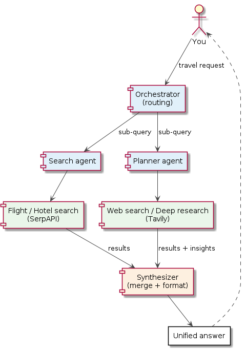
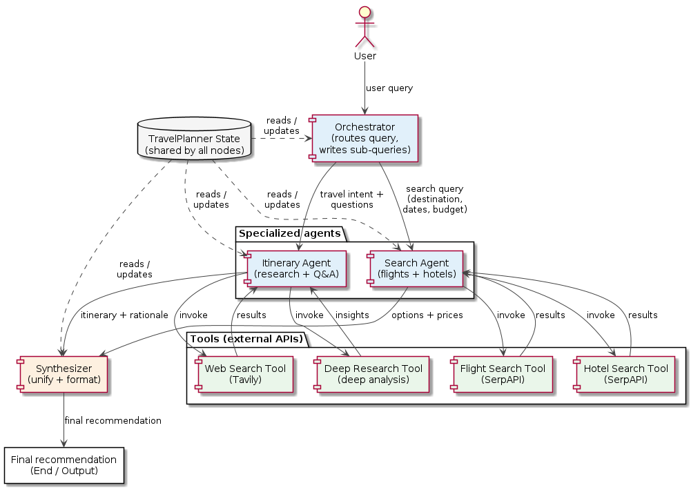

<!--
Copyright (C) 2026 Tonworio(Ton) Oguara
SPDX-License-Identifier: AGPL-3.0-or-later
-->

# Building a Smart Travel Planning Multi-Agent System with LangGraph

> **Author:** Ton Oguara — Principal Software Engineer
> **Stack:** Python 3.14 · LangGraph · LangChain · OpenAI (gpt-4o-mini) · SerpAPI · Tavily · SQLite
> **Audience:** software engineers and AI engineers who know the basics of LLM tool-calling and LangGraph, and want a concrete, opinionated walkthrough of a working multi-agent system — not a toy.

A smart travel assistant is a deceptively simple product idea and a genuinely interesting systems engineering problem. "Find me flights, a hotel, and plan my trip" sounds like one LLM call. In practice it decomposes into a cluster of *different* problems — structured booking search, multi-step itinerary research, context-window management, concurrent execution, and cross-run memory — that a single monolithic agent would fumble.

This article walks through the design and implementation of a real, working smart travel planning **multi-agent system (MAS)**: an orchestrator that routes each part of a user's request to the right specialized agent, runs independent parts in parallel, merges their results into one formatted answer, and remembers the conversation across runs. Every diagram is reproducible from the PlantUML source in the repo, and every code snippet is lifted from the working codebase.

You don't need to be a travel-industry person to follow this. The value is in a repeatable pattern for turning a compound user intent into a stateful, parallel, multi-agent LangGraph.

---

## 1. Why a multi-agent system, and why travel?

Before writing code, the design brief asks a single question that filters every downstream decision: *is this actually a MAS problem, or just an LLM call with a few tools?*

A travel planner maps cleanly onto the five "when to build MAS" criteria that the underlying material uses:

| Criterion | How it shows up in travel planning |
|---|---|
| **Too many tools** | flight search, hotel search, web search, deep research — four distinct external capabilities |
| **Specialized knowledge** | structured booking (destination, dates, budget) is a different problem from open-ended destination research and Q&A |
| **Parallelization** | flight search, hotel search, and research can all run **concurrently** |
| **Context management** | each subtask is large enough to overflow a single context window; isolating them keeps each agent focused |
| **Unified output** | the final recommendation must be re-composed from several independent results |

The five capabilities the system must deliver are, in the brief's words:

1. Search hotels and flights based on user preferences
2. Plan complete travel itineraries
3. Answer travel-related questions with deep research
4. Handle multiple queries in parallel
5. Present a unified, well-formatted travel recommendation

Capability 5 is the one that most often gets skipped in naive implementations, and it's the one that makes the difference between "the user gets two separate, contradictory lists" and "the user gets a coherent trip plan." We'll come back to it.

### The high-level picture

The README opens with a single-line sketch. Translated into a component diagram, it looks like this:



You → Orchestrator, which fans out to a **Search agent** (flights/hotels, backed by SerpAPI) and a **Planner agent** (research, backed by Tavily), both feeding a **Synthesizer** that produces the unified answer. That one picture is the whole architecture. The rest of the article is about how each box is built and, more importantly, how the wiring between them stays correct under concurrency.

---

## 2. The design method: "From idea to agents"

Rather than starting with a framework API, the design brief walks a product idea through six steps. I find it worth reproducing because it's the checklist that keeps a MAS from becoming spaghetti of nodes that all call each other.

1. **Start with the process to automate.** Enumerate what the system must do (the five capabilities above). Don't sketch an architecture yet.
2. **Map the workflow as discrete steps.** Decompose into a **Search Agent** (flights + hotels) and an **Itinerary/Planner Agent** (research + Q&A + day-by-day plan).
3. **Identify what each step needs.** Specify agent→tool interactions: which API each agent calls, and what it expects back.
4. **Design the agent state.** Define the shared `TravelPlannerState` — the single source of truth that threads user query → search results → itinerary insights → final recommendation.
5. **Build the nodes.** Implement the orchestrator/router, each specialized node, and the synthesizer, then wire the edges.
6. **Compile and test the system.** Run the LangGraph end-to-end with a real query and validate the unified output.

The order matters. It forces you to commit to a data contract (step 4) *before* you implement the nodes (step 5), which is the single thing that keeps a multi-agent system from having its components disagree about what they're sharing. In this codebase that contract lives in one TypedDict.

---

## 3. The shared state is the backbone

The most important line in the whole system is the state definition. Every node reads from and writes to this one object.

```python
# src/st/core/state.py (abridged)
from langgraph.graph.message import add_messages
from langgraph.graph.message import REMOVE_ALL_MESSAGES

def append_or_reset(left: List[dict], right: Optional[List[dict]]) -> List[dict]:
    """Reducer: append new items (concurrent writes are merged); `None` clears the list."""
    if right is None:
        return []
    return left + right

class TravelPlannerState(TypedDict):
    messages: Annotated[List[AnyMessage], add_messages]        # conversation, across turns
    user_query: str
    tasks: List[AgentTask]                                      # orchestrator's routing decisions
    requires_synthesis: bool
    agent_results: Annotated[List[dict], append_or_reset]      # merged results
    final_answer: str
    search_messages:  Annotated[List[AnyMessage], add_messages] # per-agent working history
    planner_messages: Annotated[List[AnyMessage], add_messages]
```

Two ideas in this block do most of the heavy lifting:

**Reducers are your concurrency contract.** `agent_results` uses a custom reducer, `append_or_reset`: a normal write appends, and a `None` write clears the list. This is what lets two agents write their results in the *same superstep* without one clobbering the other — LangGraph merges the two appends instead of having one overwrite the other. And `None` is the orchestrator's "start a clean turn" signal.

**Separate per-agent message channels.** `search_messages` and `planner_messages` are distinct channels because the two agents loop independently and must not read each other's tool traffic. Each keeps its own focused context window while the shared `messages` channel holds only the user↔assistant conversation that spans turns.

This is the "context management" bullet from §1, made concrete: the state is partitioned so that no agent ever has to skim through the other agent's flight JSON.

### Data contract

The two Pydantic models that ride alongside the state are worth showing because the orchestrator's job is essentially to produce them, and everything downstream consumes them.

```python
class AgentTask(BaseModel):
    source: Literal["search_agent", "planner_agent"]
    user_query: str   # self-contained sub-query for *this* agent only
    focus: str = ""   # short description of the agent's remit

class ClassificationResult(BaseModel):
    tasks: List[AgentTask]
    requires_synthesis: bool = False
```

The `user_query` on `AgentTask` is deliberately **not** the original user query. It is the orchestrator's own rewrite of the user's intent, narrowed to exactly one agent's part of the job. That single field is the heart of the "parallel but coherent" property — more on that in §4.

---

## 4. The orchestrator: one LLM call that decides the whole topology

The orchestrator is a graph node that runs once at the start of every turn. Its job is small and its design is deliberate: it makes **one** structured-output LLM call, and from that call it derives (a) which agents run, (b) a self-contained sub-query for each, and (c) whether a synthesis step is required.

```python
# src/st/agents/orchestrator.py (abridged)
def classify_query_parallel(state: TravelPlannerState):
    llm = ChatOpenAI(model="gpt-4o-mini", temperature=0)
    classifier = QueryClassifier(llm)

    messages = state.get("messages", [])
    history = messages[:-1] if messages and messages[-1].type == "human" else messages

    try:
        result = classifier.classify_query(state["user_query"], history=history)
    except Exception:
        # Defensive fallback: route the full query to both agents
        result = ClassificationResult(
            tasks=[AgentTask(source="search_agent", user_query=state["user_query"], focus="flights and hotels"),
                   AgentTask(source="planner_agent", user_query=state["user_query"], focus="travel planning")],
            requires_synthesis=True,
        )

    return {
        "tasks": result.tasks,
        "requires_synthesis": result.requires_synthesis,
        # Start a clean turn: clear last turn's working state.
        "agent_results": None,
        "search_messages":  [RemoveMessage(id=REMOVE_ALL_MESSAGES)],
        "planner_messages": [RemoveMessage(id=REMOVE_ALL_MESSAGES)],
        "final_answer": "",
    }
```

Four design choices here are load-bearing:

- **`temperature=0`.** Routing is a deterministic decision, not a creative one. A temperature of zero keeps the router's output stable and makes the behavior easier to reproduce and test.
- **Structured output, not prose.** `classifier.classify_query` (below) calls `with_structured_output(ClassificationResult)` — the model is constrained to return the exact Pydantic shape the rest of the graph expects. No JSON parsing, no regex, no "oops I returned a string."
- **Self-contained sub-queries.** The prompt's most important rule: *each agent sees only its own `user_query`, so make it complete*. The prompt explicitly forbids the search agent's task from mentioning itineraries, and forbids the planner's task from mentioning flights. This is what lets the two agents run in parallel without having to coordinate.
- **Per-turn reset.** The four `None` / `REMOVE_ALL_MESSAGES` writes at the bottom are what the `append_or_reset` and `add_messages` reducers in `core/state.py` exist to handle. Every turn starts with a clean `agent_results` and clean per-agent histories — but *the conversation* (`messages`) is preserved, which is how multi-turn memory works (see §7).

The router prompt, in the parts that matter, tells the model exactly how to partition a compound request:

```text
ROUTING RULES:
- Flight and/or hotel requests ONLY          -> one task for search_agent
- Itinerary, planning, or general Q&A ONLY   -> one task for planner_agent
- Requests that need BOTH                    -> one task for EACH agent
- Never create more than one task per agent

WRITING EACH TASK'S user_query (CRITICAL):
- Each agent sees ONLY its own user_query, so make it complete and self-contained.
- search_agent: ONLY the flight/hotel parts.
- planner_agent: ONLY the planning parts. Never mention flight or hotel searches.
- Convert relative dates into absolute YYYY-MM-DD using today's date.
```

That last rule — "convert relative dates" — is the piece of prompt engineering that makes "next Friday" work across turns. The orchestrator is given today's date in the prompt, so the sub-query the planner receives has an absolute date baked in. The agent below never has to do date math.

---

## 5. The agent ⇄ tool loop

Both worker agents use the same structure: an LLM node bound to a set of tools, and a tool node that executes whatever tool calls the LLM just made. The loop repeats until the LLM stops calling tools — at which point the agent is done and its final message is its result.

```python
# src/st/agents/search_agent.py (abridged)
def create_search_agent(llm):
    search_tools = [search_flights, search_hotels]
    tools_by_name = {t.name: t for t in search_tools}
    model_with_tools = llm.bind_tools(search_tools)

    def search_agent_node(state):
        task = get_task(state, "search_agent")
        query = task.user_query if task else state.get("user_query", "")
        focus = (task.focus if task and task.focus else "flights and hotels")
        msgs = state.get("search_messages", []) or [HumanMessage(content=query)]
        response = model_with_tools.invoke(
            [SystemMessage(content=flightHotelSearch_instructions)] + msgs
        )
        return {
            "search_messages": msgs + [response],
            "agent_results": [] if response.tool_calls else [
                {"agent": "search_agent", "focus": focus, "result": response.content}
            ],
        }

    def search_tool_node(state):
        msgs = state.get("search_messages", [])
        last = msgs[-1] if msgs else None
        if not last or not getattr(last, "tool_calls", None):
            return {"search_messages": []}
        out = []
        for tc in last.tool_calls:
            fn = tools_by_name.get(tc["name"])
            if fn is None:
                out.append(ToolMessage(content=f"Error: unknown tool {tc['name']}",
                                       tool_call_id=tc["id"]))
                continue
            try:
                obs = fn.invoke(tc["args"])
                out.append(ToolMessage(content=str(obs), tool_call_id=tc["id"]))
            except Exception as e:
                out.append(ToolMessage(content=f"Error executing tool {tc['name']}: {e}",
                                       tool_call_id=tc["id"]))
        return {"search_messages": out}

    return search_agent_node, search_tool_node
```

The planner agent (`planner_agent.py`) is structurally identical; the only things that differ are the prompt and the tool list (`web_search` + `deep_research`). That symmetry is a feature: adding a third agent is a *copy, rename, wire* exercise rather than an architectural change, and the graph builder treats them the same way.

Three implementation details are worth calling out because they're the difference between a system that works in the happy path and one that works under real inputs:

1. **Every tool call gets a `ToolMessage` reply.** If the LLM emits a `tool_call` and we don't push back a `ToolMessage` with the same `tool_call_id`, the next LLM call will fail with a "mismatched tool call" error. The two explicit branches (`fn is None`, `except Exception`) exist specifically so that *unknown* and *failing* tools both produce well-formed `ToolMessage`s, and the LLM can react.

2. **The agent's `agent_results` write is conditional on "no more tool calls."** `search_agent_node` returns `agent_results: []` whenever the last response had tool calls, because at that point the agent is mid-loop and its final text isn't ready yet. Only when the LLM stops calling tools does the result go into `agent_results`. That's the loop's termination condition, expressed as a state write.

3. **The loop is in the graph, not in the Python code.** The agent→tool→agent cycle is expressed as conditional edges in the graph builder (§6), which means LangGraph's checkpointing, the `recursion_limit`, and the deferred-synthesizer timing all come "for free" from the graph runtime.

### The tools

The four tools are where most of the real-world messiness of travel planning is handled. Two patterns recur across all four and are worth stating as general rules for any tool you build for an LLM agent:

**Rule 1 — return a compact, agent-shape result, not the raw API payload.** Raw SerpAPI flight responses are multi-megabyte JSON blobs of airport objects, airline metadata, and carbon data the agent doesn't need. The tool trims them to a small, human-and-LLM-readable summary:

```python
# src/st/tools/flight_search.py (abridged)
def _summarize_flight(option: dict) -> dict:
    return {
        "price_usd": option.get("price"),
        "total_duration_min": option.get("total_duration"),
        "stops": len(option.get("layovers", [])),
        "legs": [
            {"airline": leg.get("airline"),
             "flight_number": leg.get("flight_number"),
             "departure": _airport_time(leg.get("departure_airport", {})),
             "arrival":  _airport_time(leg.get("arrival_airport",  {})),
             "duration_min": leg.get("duration"),
             "travel_class": leg.get("travel_class"),
             "overnight": bool(leg.get("overnight"))}
            for leg in option.get("flights", [])
        ],
        "layovers": [
            {"airport": lo.get("id"), "duration_min": lo.get("duration"),
             "overnight": bool(lo.get("overnight"))}
            for lo in (option.get("layovers") or [])
        ],
    }

MAX_FLIGHT_OPTIONS = 8
# keep only the top N best/other flights, keep the price-insights block
```

The same pattern appears in `hotel_search.py` (top 8 properties *with* a price, unpriced ones are excluded and counted), and `web_search.py` (Tavily's `answer` plus short snippets, never raw page content). This is the single highest-leverage thing you can do for LLM tool costs and quality: the LLM never sees more than it needs.

**Rule 2 — validate inputs *before* spending an API credit.** Flight search requires IATA codes, and SerpAPI bills per call. The tool validates the codes up front and returns a friendly error text on mismatch, so the LLM can correct itself without burning a credit:

```python
_AIRPORT_ID = re.compile(r"[A-Z]{3}(,[A-Z]{3})*|/[mg]/\S+")

def _normalize_airport(code: str) -> Optional[str]:
    code = code.strip().upper().replace(" ", "")
    return code if _AIRPORT_ID.fullmatch(code) else None
# ...
invalid = [a for a, n in ((departure_airport, _normalize_airport(departure_airport)),
                          (arrival_airport, _normalize_airport(arrival_airport))) if n is None]
if invalid:
    return json.dumps({"error": f"Invalid airport code(s): {', '.join(invalid)}. "
                                "Use 3-letter IATA codes, e.g. 'JFK' or 'JFK,EWR,LGA'."})
```

**Round-trip flights are a subtle gotcha that has its own function.** For a round trip, SerpAPI's first call returns only the outbound options. To get the matching return flights, you have to re-call with the outbound's `departure_token`. That's one extra credit, and the tool does it transparently:

```python
# src/st/tools/flight_search.py (abridged)
def fetch_return_flights(client, params, outbound, max_options=5):
    out_nums = [leg.get("flight_number") for leg in outbound.get("flights", [])]
    try:
        result = client.search({**params, "departure_token": outbound["departure_token"]}) \
                       .as_dict()
    except Exception as e:
        return {"outbound_flights": out_nums, "error": f"Could not fetch return flights: {e}"}
    if "error" in result:
        return {"outbound_flights": out_nums, "error": result["error"]}
    options = result.get("best_flights", []) + result.get("other_flights", [])
    return {"outbound_flights": out_nums,
            "return_options": [_summarize_flight(o) for o in options[:max_options]]}
```

### Deep research as a sub-agent in a tool

The planner's second tool, `deep_research`, is the one that surprises people. It looks like a single tool call from the planner's perspective, but internally it's *another* multi-step agent (a `deepagents` graph) that plans its own research with Tavily and produces a day-by-day itinerary.

```python
# src/st/tools/deep_research.py (abridged)
@lru_cache(maxsize=1)
def get_itinerary_research_agent():
    from deepagents import create_deep_agent
    model = ChatOpenAI(model=os.getenv("DEEP_RESEARCH_MODEL", "gpt-4o-mini"), temperature=0.2)
    internet_search = TavilySearch(max_results=5, topic="general",
                                   search_depth="advanced", include_answer=True)
    return create_deep_agent(model=model, tools=[internet_search],
                             system_prompt=research_instructions,
                             name="itinerary_research_agent")

@tool("deep_research", description="Run deep, multi-step travel research...")
def deep_research(query: str) -> str:
    agent = get_itinerary_research_agent()
    result = agent.invoke({"messages": [{"role": "user", "content": query}]},
                          config={"recursion_limit": DEEP_RESEARCH_RECURSION_LIMIT})
    return result["messages"][-1].text
```

You get the benefit of an autonomous planning loop (the sub-agent decides what to look up, in what order) without the planner itself having to manage that loop. The `@lru_cache` builds it once and reuses it, and the `recursion_limit` of 60 caps it — the code comments note deepagents otherwise defaults to a much larger budget (9,999 steps), which is what a runaway research loop looks like in production if you don't set one.

This is the general pattern for "an agent that needs a *very* focused sub-task that has its own planning loop": give it its own graph, expose it through a tool, and let the calling agent treat it as one atomic operation.

---

## 6. The graph: parallel lanes, a deferred merge, and the checkpointed runtime

The graph builder is where the four pieces — orchestrator, two agents, two tool nodes, and the synthesizer — become the LangGraph.



```python
# src/st/graph/builder.py (abridged)
def build_parallel_travel_agent(llm, checkpointer=None):
    search_node,  search_tool_node  = create_search_agent(llm)
    planner_node, planner_tool_node = create_planner_agent(llm)
    synth         = create_synthesizer(llm)

    workflow = StateGraph(TravelPlannerState)
    workflow.add_node("orchestrator", classify_query_parallel)
    workflow.add_node("search_agent", search_node)
    workflow.add_node("search_tool",  search_tool_node)
    workflow.add_node("planner_agent", planner_node)
    workflow.add_node("planner_tool", planner_tool_node)
    # Deferred: runs once, AFTER every dispatched agent lane has finished (fan-in)
    workflow.add_node("synthesizer", synth, defer=True)

    def route_to_agent(state):
        tasks = state.get("tasks", [])
        if not tasks:
            return ["search_agent", "planner_agent"]   # defensive default
        agents = set()
        for t in tasks:
            if   t.source == "search_agent":  agents.add("search_agent")
            elif t.source == "planner_agent": agents.add("planner_agent")
        return list(agents) or ["search_agent", "planner_agent"]

    workflow.add_conditional_edges("orchestrator", route_to_agent,
                                   path_map=["search_agent", "planner_agent"])

    # Each agent loops: agent -> tool -> agent, until it stops calling tools
    workflow.add_edge("search_tool",  "search_agent")
    workflow.add_edge("planner_tool", "planner_agent")
    workflow.add_conditional_edges("search_agent",  lambda s:
        "search_tool" if getattr(s.get("search_messages",  [])[-1], "tool_calls", None)
                                  else "synthesizer")
    workflow.add_conditional_edges("planner_agent", lambda s:
        "planner_tool" if getattr(s.get("planner_messages", [])[-1], "tool_calls", None)
                                   else "synthesizer")

    workflow.add_edge("synthesizer", END)
    workflow.set_entry_point("orchestrator")
    return workflow.compile(checkpointer=checkpointer)
```

Three things in this block are the architectural signature of the system:

**Parallel fan-out from the orchestrator.** `route_to_agent` returns a *list* of node names. LangGraph runs every node in that list in the same superstep — meaning the search agent and the planner agent run **concurrently**, not sequentially. A request that needs both gets both in parallel, and the total wall-clock time is `max(search, planner)`, not their sum.

**Independent tool loops.** Each agent's conditional edge inspects its *own* message channel (`search_messages` vs. `planner_messages`). That's what lets one agent be mid-loop on hotel search while the other agent has already finished and handed its result to the synthesizer. The two lanes are completely self-contained.

**The deferred synthesizer is the linchpin.** `add_node("synthesizer", synth, defer=True)` tells LangGraph: *wait until every dispatched lane has finished before running this node*. Without `defer=True`, the synthesizer could fire as soon as *one* agent finished, producing a half-merged answer with the other agent's results still in flight. With it, the synthesizer sees the *complete* set of `agent_results` and merges them into the final answer. This is the single most important "don't get it wrong" detail in the whole system, and it's one line of config.

The synthesizer itself is a single LLM call. It's the "unified output" capability made concrete:

```python
# src/st/synthesizer/synthesizer.py (abridged)
def create_synthesizer(llm):
    def synthesizer_node(state):
        results = state.get("agent_results", [])
        if not results:
            return {"final_answer": "I'm still gathering information. Please try again.",
                    "messages": [AIMessage(content="Gathering information...")]}
        results_formatted = "\n\n" + "\n\n".join(
            f"**{r['agent'].upper()}**\nFocus: {r.get('focus', 'N/A')}\n\n{r['result']}"
            for r in results
        )
        prompt = """You are a Travel Response Synthesizer. Combine multiple agent outputs
into a single, well-organized, comprehensive response.
RULES:
1. Organize logically (Flights -> Hotels -> Itinerary -> Tips), but ONLY include
   sections the agent results actually cover.
2. Never invent flights, hotels or prices that are not in the agent results.
3. Highlight key recommendations.
4. Note any conflicts or alternatives.
5. Create clear sections with headers.
6. End with actionable next steps.
Original Query: {query}

Agent Results:
{results}

Create a unified, helpful response:""".format(query=state["user_query"],
                                                results=results_formatted)
        response = llm.invoke([SystemMessage(content=prompt)])
        return {"final_answer": response.content,
                "messages": [AIMessage(content=response.content)]}
    return synthesizer_node
```

Note the two guard rules in the prompt — *only include sections you have evidence for* and *never invent prices* — because they're the only thing standing between "a good answer" and "a confident, wrong answer." The synthesizer is, by construction, the one LLM call in the system that is allowed to make up text; these two rules are what keep it honest.

---

## 7. Memory: a checkpointer turns state into a conversation

The state in §3 has a `messages` channel that's explicitly marked as spanning turns. What makes that *work* across separate process invocations is LangGraph's checkpointer: after every graph step, the entire `TravelPlannerState` is serialized to a per-thread SQLite database. A later run on the same `thread_id` reloads it.

```python
# src/st/memory/checkpointer.py (abridged)
CHECKPOINT_TYPES = [("st.core.state", "AgentTask")]   # strict deserialization allow-list

@asynccontextmanager
async def open_checkpointer(db_path=None):
    path = Path(db_path or os.getenv("TRAVEL_PLANNER_DB_PATH")
                              or "data/travel_planner_memory.sqlite")
    path.parent.mkdir(parents=True, exist_ok=True)
    serde = JsonPlusSerializer(allowed_msgpack_modules=CHECKPOINT_TYPES)
    async with aiosqlite.connect(str(path)) as conn:
        yield AsyncSqliteSaver(conn, serde=serde)

def thread_config(thread_id: str = "default"):
    return {"configurable": {"thread_id": thread_id}}

def new_turn_input(query: str, new_conversation: bool = False):
    clear_prev = [RemoveMessage(id=REMOVE_ALL_MESSAGES)] if new_conversation else []
    return {"user_query": query,
            "messages": clear_prev + [HumanMessage(content=query)]}
```

Two design details make this more than "save/load":

- **The strict serializer allow-list** (`allowed_msgpack_modules=CHECKPOINT_TYPES`) is a security and correctness guard: only LangGraph's built-in safe types plus the `AgentTask` we explicitly declared will be deserialized from the database. That matters the moment a user-controlled query ends up in a checkpoint — which it does, by design — because it means a malformed or malicious state can't inject arbitrary Python objects on the way back out.
- **The CLI is the product surface.** The same checkpointer powers the one-shot, chat, `--history`, and `--audit` modes. `--audit` walks `graph.aget_state_history(...)` and, for every node execution, lists exactly what that node wrote into the state — which tasks it created, which tools it called with what arguments, which results were produced. That's the difference between "trust me, it worked" and "here's the transcript."

```bash
st "Plan a 3-day itinerary in Lisbon from 2026-11-10 to 2026-11-13"
st --thread-id lisbon "Now find me round-trip flights from New York for those dates"
st --audit --thread-id lisbon
```

The second query works because the orchestrator (§4) reads `messages[:-1]` as *history* before classifying, so "those dates" resolves against the first turn's content. That's the full loop: checkpointer → orchestrator → sub-query → agents → synthesizer → checkpointer.

---

## 8. What the system does today (and where it stops)

The CLI supports six request shapes: one-way flights, round-trip flights, hotels, an itinerary, a general travel question, and the compound "flights + hotels + itinerary" case — which exercises the full parallel path and the deferred synthesizer. A typical run takes 30–60 seconds and costs a handful of OpenAI calls plus one or two SerpAPI credits and one or more Tavily searches.

It is, by explicit design, a *search-and-plan* system, not a *book* system. Two boundaries are documented in the README and enforced by the tools: results are a snapshot of Google Flights/Hotels and the web, and return flights are listed only for the cheapest outbound option (the round-trip cost is the full outbound+return total for that pair).

Three extension paths have already been validated by the tests and the module layout — the code is deliberately shaped so each one is a bounded change:

- **Add a tool to an existing agent:** drop a new `@tool` function into `tools/`, add it to the agent's tool list, and mention it in the prompt. No graph changes.
- **Add a new agent:** copy `search_agent.py`, add a `<name>_messages` channel to `TravelPlannerState`, and add the agent to `route_to_agent`'s `path_map`. The rest of the graph pattern — tool loop, deferred merge, checkpointing — is unchanged.
- **Swap SQLite for Postgres:** `open_checkpointer` is the only place a concrete saver type appears. Replacing `AsyncSqliteSaver` with `AsyncPostgresSaver` is a one-line change at the seam.

---

## 9. Lessons that will save you time

If you're building something similar, the five lessons below are the ones that actually cost me time the first time through:

1. **Let the graph, not your code, own the loops.** The agent⇄tool cycle, the parallel lanes, and the deferred fan-in are all *graph structure*, which means they inherit checkpointing, `recursion_limit`, and deterministic ordering from the LangGraph runtime for free. The moment you reach for a `while` loop inside a node to re-call the LLM, you've moved your control flow out of reach of the runtime, and you've lost those guarantees.

2. **Use reducers as your concurrency contract.** Two nodes writing to the same key in the same superstep is a runtime error unless you've told LangGraph how to combine the writes. `append_or_reset` isn't clever — it's the minimum needed for any state that more than one node contributes to in parallel.

3. **Return compact results from tools.** This is the single highest-leverage thing you can do for cost *and* quality. A 40 KB raw API payload is a 40 KB tax on every LLM call in the loop, and most of it is noise the model will ignore anyway. Trim at the tool boundary and the loop gets cheaper *and* more reliable.

4. **The deferred synthesizer isn't optional polish.** It's the difference between "a good answer" and "a confident, half-merged, wrong answer." `add_node(..., defer=True)` is one line and the difference between "parallel" and "actually parallel in the way you meant."

5. **Make the checkpointer a security boundary, not just a cache.** Deserializing state you saved against input you can't fully control (which, if your query is user-provided, you can't) is a real attack surface. The strict deserializer allow-list in `open_checkpointer` is a 20-line guard that turns "I trust my DB" into a defensible claim.

---

## Closing

A smart travel planner is a good test of whether you can hold a multi-agent system together under real constraints — concurrency, context windows, cost, and honesty about what the LLM is allowed to make up. The answer, in this codebase, is six small modules that share one state, one orchestrator call that decides the topology, one deferred merge node, and one checkpointer that turns the whole thing into a conversation.

The design brief this article is based on — the "From idea to agents" method — is a reusable checklist for *any* of these systems, travel or not:

*Start with the process to automate → map the workflow → define each step's inputs and outputs → design the shared state → build the nodes → compile, checkpoint, and test.*

If your product decomposes into two or more genuinely different sub-problems, and those sub-problems can run concurrently, and the answer has to be re-composed from their parts, you probably don't need a bigger model. You need the graph.

---

### Appendix A — Reproducing the diagrams

Both diagrams in the article are component-based PlantUML. Their source lives under `docs/`:

| File | Shows |
|---|---|
| `docs/smart_travel_mas_high_level_overview.puml` | You → Orchestrator → Search / Planner agents → their tools → Synthesizer → Unified answer |
| `docs/smart_travel_mas_e2e_dataflow.puml` | Full end-to-end flow, including the shared `TravelPlannerState`, the four tools, and the final recommendation |

Render with any PlantUML distribution:

```bash
plantuml -tsvg smart_travel_mas_e2e_dataflow.puml smart_travel_mas_high_level_overview.puml
```

### Appendix B — Where to read and run it

The system runs as the `st` CLI:

```bash
st "Flights from JFK to LIS on 2026-11-10 returning 2026-11-14, " \
   "hotels for those dates, and a 4-day food itinerary"
st --thread-id lisbon --audit        # inspect what actually ran
st --chat                             # interactive, multi-turn
```

The codebase is a standard `src/` Python package under uv. `uv sync` and run `uv run pytest` first — 51 tests, no network, in well under a second.
